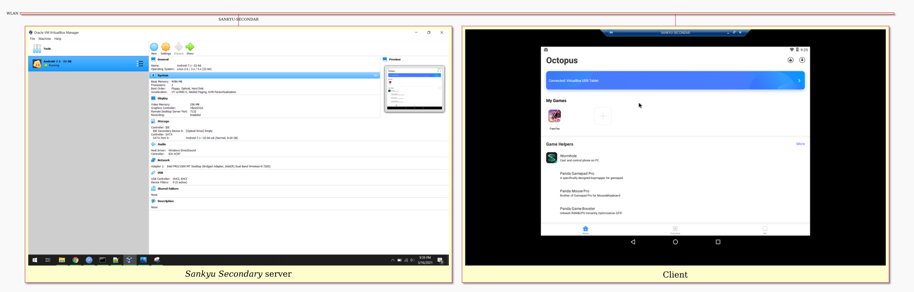

# VRDP Cloud Gaming
_A poor man's cloud gaming service._ `#networking #VirtualBox #AndroidX86 #VMI(?)`

**VRDP** stands for "**V**irtualBox **R**emote **D**esktop **P**rotocol"
~~or "**V**ain and **R**eally **D**esperate, **P**otato-based attempt at cloud gaming"~~.

**_This is not a blog post, but more like my chaotic "engineering daybook entry"_**.

---

**Update**:
I guess what I've tried to accomplish can be described as ***virtual mobile infrastructure*** (VMI).  
(Wikipedia path: [wiki:Cloud gaming] &rarr; [wiki:Remote mobile virtualization] &rarr; VMI.)

[wiki:Cloud gaming]: https://en.wikipedia.org/wiki/Cloud_gaming
[wiki:Remote mobile virtualization]: https://en.wikipedia.org/wiki/Remote_mobile_virtualization

---

Sometimes, my little brother uses my laptop to play video games since his PC can't run somewhat demanding video games, let alone emulators.  
While he was playing Free Fire using BlueStacks on my machine,
I thought to myself, "Hold up, I can do something similar using VirtualBox + Android-x86 + some keyboard/mouse mapping app...
and that's not all: I can let him play remotely from his PC using something like VNC or RDP or whatever..."

So, yeah, that's what I've attempted: Creating my own BlueStacks-like thing and making it act as a "cloud gaming server" for my local network,
so that my brother can play from his "potato PC" using my "high-end server" (not like mine is any better _\*shaking my head\*_).

Did it work as I wanted? _Yesn't_... More like, "so close, yet so far away".

>   
> Network diagram (sorta). It shows the remote client (right) going to open Free Fire from within the Octopus app.

> ![RDP client showing Free Fire loading screen with keyboard mappings overlay][img-remote-client-ff-loading]  
> ![RDP client showing Free Fire's home screen][img-remote-client-ff-home]  
> Windows 10 client on a potato PC ("LAPTOP-AMINE").

---

<details>
<summary>Screenshotted scenario: Client starts playing FF</summary>

1. _Sankyu Secondary_ server (my laptop as always) starts running an Android 7.1 32-bit VM and exposes it to RDP clients on Port 7132.  
  ![VirtualBox Manager: VM details][img-remote-server-details]

2. Client connects to the VM using the server's hostname, "SANKYU-SECONDAR"(Y), and Port 7132.  
  ![][img-remote-client-connect]

3. Client opens the Octopus app, which identifies and lists known, installed games (only Free Fire, in our case).  
    ![][img-remote-client-octopus-home]

4. Free Fire is loading, and Octopus is drawing a customized layout that maps keyboard press events to the game's "touch buttons".  
    ![][img-remote-client-ff-loading]

5. Free Fire home screen  
    ![][img-remote-client-ff-home]

6. Server logs showing the establishment of the connection and negotiation of RDP features  
    ![][img-remote-server-logs]

</details>


## Requirements

We'll need the following programs (versions were documented for no good reason):

- VirtualBox: `VirtualBox-6.1.18-142142-Win.exe`

- VirtualBox Extension Pack: `Oracle_VM_VirtualBox_Extension_Pack-6.1.18.vbox-extpack`

- Android-x86: Version 7.1
    * [x] `android-x86_64-7.1-r5.iso`. "Android-7.1--64-bit" ~~won't boot~~ needed to use _VBoxSVGA_ as a graphics controller.
    * [ ] KAITO: Consider trying `android-x86_64-7.1-r5-k419.iso`  
          it's the same as without m419, except the k419 is "a special build, built on the stable Linux kernel 4.1.9"  
          https://osdn.net/projects/android-x86/releases
    * [x] `android-x86-7.1-r5-k419.iso`. Android 7.1 32-bit worked fine for BlueStacks 4.
          Or maybe simply use the 32-bit if it runs FF well.
          At least I will be able to transfer the virtual machine to another PC without Intel's Virtualization Technologies and run it.

- Some video game: **_Garena Free Fire - Cobra_** (FF), v1.59.5, updated on 2021-02-08

- Some keyboard/mouse mapping app: _Octopus Gaming Studio_'s **_Octopus_** v6.1.3, updated on 2021-02-25.
    * [playstore:octopus]

- Some RPD client: _Microsoft Remote Desktop client_ (pre-installed on Windows).


## Steps

<details>
<summary>Redacted Steps</summary>

- Install VirtualBox and then the extension pack.

- Create a new "generic Linux" VM. Change its graphics controller to _VBoxSVGA_.

- Install Android-x86 to the virtual disk. Reboot and set it up as you'd set up a newly formatted phone.

- Install a keyboard mapper and whatever games from the Play Store.

- Open the VM's "Configuration" window > "Display" section > "Remote Display" tab and enable it.

- At this point, we're done with the server.

- Client: Using an RDP client, connect to the VM using the server's hostname or IP or even its domain name (DDNS?) if you have one and want to take it that far.  
You may need to specify the port number.

</details>

- Run FF with an unacceptable/**ugh** performance.
    * BlueStacks runs it with an **ok** performance.

- Realize that shit ain't as simple as it seems.


## Possible Optimizations

- [x] VirtualBox: Run in _Headless_ mode.

- [x] Set "Video RAM" to the max (256):
```cmd
vboxmanage modifyvm "Android-7.1--32-bit" --vram 256
```

- Wi-Fi may be an issue. Both machines are connected via WLAN (802.11n), which operates in half-duplex.
    * [ ] LEARN: (SU-)MIMO doesn't help, does it?
    * [ ] Actually READ: [What Is Half-Duplex And Full-Duplex Operation, And How Does It Affect Your Router?](https://www.makeuseof.com/tag/what-is-half-duplex-and-full-duplex-operation-and-how-does-it-affect-your-router/)
        `[archived:20210317084547]`

- [ ] Bluetooth PAN might help since it is full-duplex AFAIK.
    * Windows 10 supports tethering ("mobile hotspot") via Bluetooth.
        Also, it can join a Bluetooth PAN (Tray > \*Right click* Bluetooth icon > Join a Personal Area Network).
    * [ ] FIXME: Tethering internet from Wi-Fi to Bluetooth seems to work fine;
                however, as soon as I connect with my Android phone, Windows turns off Wi-Fi.
                When I disable Bluetooth on my phone, Windows re-activates Wi-Fi and Bluetooth tethering stays activate (but with 0 clients).
                Weird. Same issue if a Windows 10 client connects?

- [ ] Instead of Android 7.1, use a version that has the least hardware requirements, yet is able to run our games/apps. 4.4? 5.0?
    * [ ] LEARN: FF needs 4.1+, but what about Octopus and others?

- [ ] Try using VNC.
Maybe VNC would be better than RDP since games are pixel heavy (draw on a canvas, kinda) and RDP's transferring of UI controls/primitives may be inefficient.

- [ ] Use a copy-on-write (virtual) filesystem.  
We only need one base image (contains Android and maybe pre-installed games) to run multiple VMs (for each user) since only login data and maybe game saves differ between them.


## BlueStacks 4 Details

Tried to mimic BlueStacks 4 since it works kinda okay on my laptop...

- For full details, see `virtualbox-vminfo-bluestacks-v4.270.txt`.

```cmd
cd C:\Program Files\BlueStacks

REM KAITO: BstkVMMgr.exe is actually VBoxManage.exe

BstkVMMgr --version
REM > 2.1.24r117012
REM ---
REM KAITO: Seriously? VirtualBox 2.1!? I can't even find (online) its builds, let alone the extension pack to activate Remote Display.

BstkVMMgr list extpacks
REM > Extension Packs: 0

BstkVMMgr list vms
REM > "Android" {87bb8c18-a755-46c6-ba82-2a0deb17bac3}

BstkVMMgr showvminfo "Android"
REM See `virtualbox-vminfo-bluestacks-v4.270.txt`

BstkVMMgr export "Android" --output %TEMP%\BlueStacks-v4-Android.ova
REM > 0%...10%...20%...30%...40%...50%...60%...70%...80%...90%...100%
REM > Successfully exported 1 machine(s).
REM ---
REM The exported file is 2.61GB (contains FF and Octopus and whatever).
REM Tried importing it to VirtualBox 6.1 but failed. This is unsurprising: BS uses custom drivers (.dll) or whatever.
```

<details>
<summary>BlueStacks V4 screenshotted default specs/configs</summary>

![img-bluestacks-about-version]  
![img-bluestacks-about-engine]  
![img-bluestacks-deviceinfohw-general]  
![img-bluestacks-deviceinfohw-soc]  
![img-bluestacks-deviceinfohw-system]  

- **Display**:
    * **Resolution**:
        + Landscape (Tablet mode)
        + 160 x 900
    * **DPI**: 240 DPI

- **Device profile**: Samsung Galaxy S8 Plus

- **Engine**:
    * CPU: Medium (2 Cores)
    * RAM: 1800MB
    * ASTC texture (Beta): Disabled
    * Frame rate: 60 FPS
    * ABI setting: Auto (the other option being ARM)

</details>

> ![][img-bluestacks-free-fire]  
> Free Fire on BlueStacks v4

---

## My Android-x86 VM details
- Config of my virtual machine "Android-7.1--32-bit":
    * **Graphics Controller**: _VBoxSVGA_
    * **Video Memory**: ~~_128 MB_~~ _256 MB_
    * **Guest OS Type**: _Linux 2.6 / 3.x / 4.x (32-bit)_
    * **Remote Desktop**: Port: _7132_, Auth: _Null_, 
    * Android Kernel: 4.19
    * Reported to Android that it supports **OpenGL ES 3.0 SwiftShader 4.0**
    * For full details, see `virtualbox-vminfo-android-7.1--32-bit.txt`


## Protocols Considered

- **RDP**
    * _Pro_: Windows has a built-in RDP client, _Microsoft Remote Desktop_.
    * Supposed to be more lightweight than VNC, but is it really? Games rely on "pixels" (canvas) more than "shapes" (UI controls, etc.).

- **VNC**
    * _Pro_: It is open.
    * I think VirtualBox supports only RDP natively. An NVC plugin exists though.
    * [ ] Test it

- **ADB protocol**
    * `scrcpy` was created by @Genymobile of which Genymotion.com is a product.


## Other Options

- [x] **BlueStacks** v4
    * Run FF with an **ok** performance.
    * Based on VirtualBox.
    * Have their own Android build. Not based on Android-x86, is it?
    * Android 7.1.2 32-bit. Why 32-bit? Because they wanted their program to be compatible with all hosts even those that don't have (or have disabled) Virtualization Technology?
    * Android Kernel: 4.9.31
    * Reported to Android that it supports **OpenGL ES 3.0**
    * Video RAM: _12MB_
    * RAM: 2GB.

- [x] **Phoenix OS** `PhoenixOSInstaller_v3.6.1.564_x64.iso`
    * KAITO: Only installed because PUBG-Mobile-playing Redditors spoke well of it.
    * KAITO: Tried on real hardware.
    * Based on Android-x86.
    * Uses the Octopus app for mapping keyboard/gamepad/mouse input to touch events.
    * _Con_: Didn't run FF. Kept crashing.
    * _Con_: Contains ads.
    * _Con_: Google Play Protect considered their "VIP Service" app as unwanted/harmful/spam or something.

- [x] **Genymotion**
    * Uninstalled it as soon as I realized it was a general-purpose emulator (for developers and testers and stuff).

- [ ] **RDP Remote Desktop Shadowing mode**
    * Tried `RDPWrap-v1.6.2`: https://github.com/stascorp/rdpwrap
        + Failed to run. Didn't try to fix it.
    * [ ] CHECK LATER: http://woshub.com/rdp-session-shadow-to-windows-10-user/

- [ ] **TeamViewer** or something similar
    * IDEA: Restrict access to a new desktop/workspace with BlueStacks v4 running + support two cursors/mice (one for me and another for the remote user).


## References

- [VirtualBox HowTo | Android-x86](https://www.android-x86.org/documentation/virtualbox.html)

- Oracle® VM VirtualBox® - User Manual
    * [Chapter 7. Remote Virtual Machines](https://www.virtualbox.org/manual/ch07.html)
    * [Chapter 8. "VBoxManage export" section](https://www.virtualbox.org/manual/ch08.html#vboxmanage-export)
    * [Chapter 1. "About the OVF Format" section](https://www.virtualbox.org/manual/ch01.html#ovf)
    * KAITO/TLDR: `.ova` is the single-file archive of the OVF mutli-file export result.

- Oracle® VM VirtualBox - Administrator's Guide for Release 6.0
    * [1.1. Remote Display (VRDP Support)](https://docs.oracle.com/en/virtualization/virtualbox/6.0/admin/vrde.html)

- ["Virtualization: 64-bit or 32-bit?" | Server Fault](https://serverfault.com/questions/222154/virtualization-64-bit-or-32-bit)
    * KAITO: _\*Shrugs\*_, 32-bit seems fine to me. No compelling reason to use 64-bit.

<!-- LINKS -->

[playstore:octopus]: https://play.google.com/store/apps/details?id=com.chaozhuo.gameassistant "Octopus app on Google Play"

[img-remote-client-connect]: ./screenshots/remote-client-connect.png "Remote Desktop Connection with connection string SANKYU-SECONDAR:7132"
[img-remote-client-octopus-home]: ./screenshots/remote-client-octopus-home.png "RDP client: Octopus home"
[img-remote-client-ff-loading]: ./screenshots/remote-client-ff-loading.png "RDP client: FF loading with key mapping overlay"
[img-remote-client-ff-home]: ./screenshots/remote-client-ff-home.png "RDP client: FF home"
[img-remote-server-logs]: ./screenshots/remote-server-logs.png "VirtualBox Manager: Logs"
[img-remote-server-details]: ./screenshots/remote-server-details.png "VirtualBox Manager: Details"

[img-bluestacks-about-version]: ./screenshots/bluestacks-about-version--2021-03-16.png "BlueStacks: About version"
[img-bluestacks-about-engine]: ./screenshots/bluestacks-about-engine--2021-03-16.png "BlueStacks: About engine"
[img-bluestacks-deviceinfohw-general]: ./screenshots/bluestacks-deviceinfohw-general--2021-03-16.png "BlueStacks: Device Info HW: General"
[img-bluestacks-deviceinfohw-soc]: ./screenshots/bluestacks-deviceinfohw-soc--2021-03-16.png "BlueStacks: Device Info HW: SoC"
[img-bluestacks-deviceinfohw-system]: ./screenshots/bluestacks-deviceinfohw-system--2021-03-16.png "BlueStacks: Device Info HW: System"
[img-bluestacks-free-fire]: ./screenshots/bluestacks-free-fire--2021-03-14.png "BlueStacks: Free Fire"

<style>
img {
    max-width: 75vw;
}
</style>

---

END.
