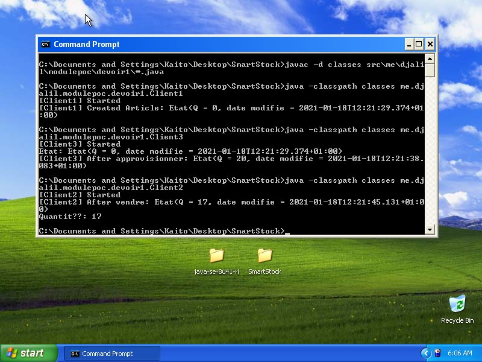

---
date: "2021-01-18"
permalink: "/jdk-8-on-window-xp/"
...

# JDK 8 on Windows XP
#WindowsXP #Java

I don't know who might find this useful, but:

If you have a super/dead old computer that can only run Windows XP, you could still use it to test client/server projects (#ModuleDAAW or #ModulePOC for example).  
The latest build of OpenJDK 8, which is more than enough for our use-cases, runs perfectly well on Windows XP.

As proof that it works, I've included this screenshot...
It shows that you can compile and run a Java RMI project from the command line (I didn't try installing an editor).
What you are seeing here is that this "laptop" (ToDeath/`192.168.1.42`) is acting as Client(s) to the Server running on the same network (exactly ThankYou/`192.168.1.39`).

TESTED WINDOWS VERSION: Windows XP Professional SP3 32-bit

TESTED JDK BUILD: openjdk-8u41-b04-windows-i586-14_jan_2020

OFFICIAL DOWNLOAD PAGE: https://jdk.java.net/java-se-ri/8-MR3

