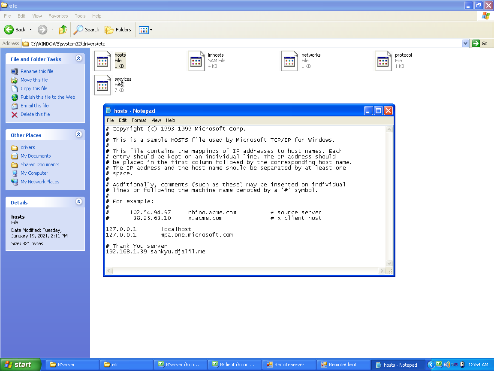

## Problem: How to handle the dynamic nature of our external IPs?

You can use a **dynamic DNS** service like DuckDNS, No-IP, or an open-source alternative like `nsupdate.info` or whatever.  
I've tried only No-IP and DuckDNS and found the latter to be the simplest, most no-nonsense option.
I've been using DuckDNS for over two years now.

KAITO: I'm using `sankyu.djalil.me` like a personalized(?) alias for my DuckDNS domain (`kurage.duckdns.org`).  
`kurage.duckdns.org`'s A record is periodically updated by our DuckDNS client, ~~`KurageBot.js`~~ `DuckUpdater.java`.


## Problem: Can't access local machines using their external IP (NAT loopback issue)
Due to the NAT loopback problem, we can not access LAN "servers" using their external IPs or DDNS domains.

You may want to read what [ConnectWise writes about this issue][connectwise-nat].

Since I have only two machines, I opted for the simplest solution/workaround and edit the `hosts` file.
- Linux (Ubuntu 18.04): Edit `/etc/hosts`
- Windows (Windows XP): Edit `C:\WINDOWS\system32\drivers\etc\hosts`
And add an entry that resolves with a local address for the server:
```
# Thank You server
192.168.1.39 sankyu.djalil.me
```



---

### Output of running `dig`

If resolved normally (the local `hosts` file is used):
```console
djalil@Sankyu:~$ dig sankyu.djalil.me

; <<>> DiG 9.11.3-1ubuntu1.13-Ubuntu <<>> sankyu.djalil.me
[...]

;; ANSWER SECTION:
sankyu.djalil.me.       0       IN      A       192.168.1.39

;; Query time: 0 msec
;; SERVER: 127.0.0.53#53(127.0.0.53)
[...]
```

---

If resolved explicitly using Google's public DNS server (i.e. the `hosts` file is not used):
```console
djalil@Sankyu:~$ dig @8.8.8.8 sankyu.djalil.me

; <<>> DiG 9.11.3-1ubuntu1.13-Ubuntu <<>> @8.8.8.8 sankyu.djalil.me
[...]

;; ANSWER SECTION:
sankyu.djalil.me.       299     IN      CNAME   kurage.duckdns.org.
kurage.duckdns.org.     59      IN      A       105.107.130.104

;; Query time: 541 msec
;; SERVER: 8.8.8.8#53(8.8.8.8)
[...]
```

## ~~Problem: Java RMI complains that hostname doesn't match~~

~~If both Alice (`Arisu.duckdns.org`) and Bat (`Batto.duckdns.org`) point to the same host (e.g. `Sankyu`),
but the server declares Alice and the client requests it as Bat, an `Exception` gets thrown.~~  
~~What's the use of hostname in Java RMI and why does it need to match?~~

- [ ] LEARN: What's the use of the hostname property anyway?  
I get the [`Host` header in HTTP (MDN)][mdn-http-host], but what about Java RMI similar?

---

## References

- [IPalyzer](https://ipalyzer.com)

- [What port is used by Java RMI connection? | Stack Overflow](https://stackoverflow.com/questions/3071376/what-port-is-used-by-java-rmi-connection)

- [Cannot access external IP address from LAN | ConnectWise][connectwise-nat] `[archived:20210119134637]`

- [A Proper Server Naming Scheme SSD VPS Cloud Hosting | mnx.io](https://mnx.io/blog/a-proper-server-naming-scheme/) `[interesting][archived:20210114215447]`

- [Standardizing Host and Server Naming Conventions | The Official Device42 Blog](https://www.device42.com/blog/2014/02/standardizing-host-and-server-naming-conventions/) `[interesting][archived:20210119113931]`

- Also see:
    * [wiki:Port triggering][]
    * [wiki:Port forwarding][]

[connectwise-nat]: https://docs.connectwise.com/ConnectWise_Control_Documentation/On-premises/On-premises_knowledge_base/Cannot_access_external_IP_address_from_LAN
[mdn-http-host]: https://developer.mozilla.org/en-US/docs/Web/HTTP/Headers/Host
[wiki:Port triggering]: https://en.wikipedia.org/wiki/Port_triggering#Disadvantages
[wiki:Port forwarding]: https://en.wikipedia.org/wiki/Port_forwarding

---

END.
