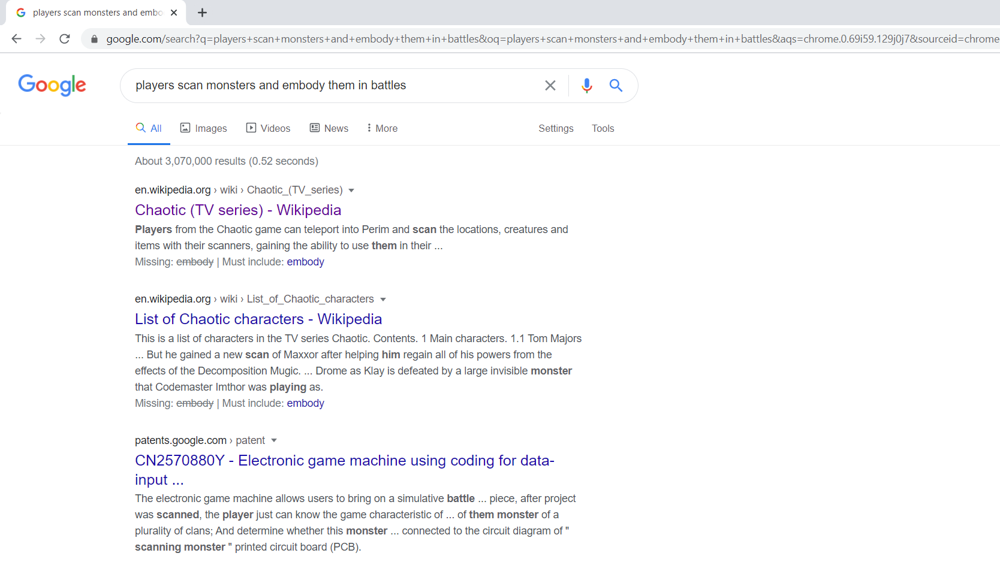

# Chaotic
#cartoon #nostalgia

<strong><i lang="ar">
عالم الفوضى
</i></strong>
(lit. _World of Chaos_) / **Chaotic**.

About the series I watched as a child (Arabic dubbed on MBC3)...

One day, it just came to my mind and I had to try to find it...

I googled the premise of the cartoon as I remembered it, and this is what I got:
> 
> Google Search results for "players scan monsters and embody them in battles"

- Turned out it's based on a card game and had an online version, sounded awesome.
There was an online video game as well.

- Interesting and informative video by Negative Legend: [What Happened to Chaotic](https://youtu.be/olplAC3Pkno)

## Links

- [Chaotic official YouTube channel](https://www.youtube.com/channel/UCPdGCLOuKv_74yFawt2oehw)
    * **Note**: The complete series is up there for free, but is of low resolution (240p to 360p).

- [Chaotic TV Series | Trailer | YouTube](https://www.youtube.com/watch?v=ZNxJN3_w7Dk)

- [Chaotic (TV series) | Wikipedia](https://en.wikipedia.org/wiki/Chaotic_(TV_series))

- https://ar.wikipedia.org/wiki/%D8%B9%D8%A7%D9%84%D9%85_%D8%A7%D9%84%D9%81%D9%88%D8%B6%D9%89

---

END.
