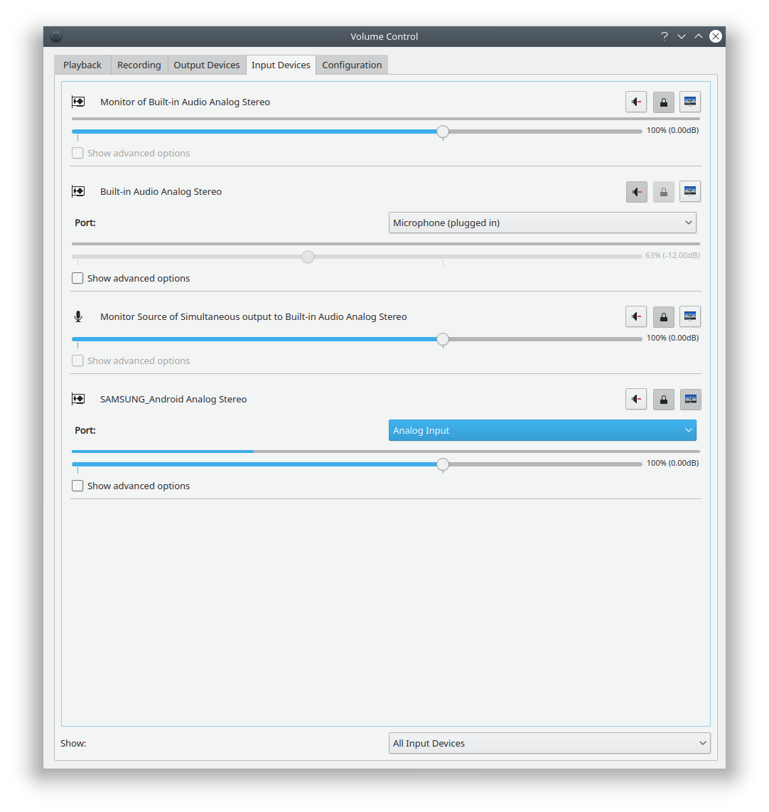

# Android (USB Audio Accessory) as Microphone
#USB #Android

- Facebook Post 2021-02-06
- LinkedIn Post 2021-02-09

---

Read along if you need a working microphone (e.g. for "online education"), but you don't want to buy one for whatever reason...

Brief: You can connect your Android phone to the computer and use it as a USB microphone.

I have used two open-source projects to do it:
1. A CLI utility called USBAudio[3] to request that the Android device enables USB audio accessory mode (so that we are treated as an audio sink, like plugged earphones):  
`usbaudio --no-play`.
2. An Android app called Microphone[4][5] to feed the phone's audio input (the built-in microphone) to its default output (speakers, headsets, or *the newly activated USB audio accessory*, etc.).

The screenshot shows that my phone is now acting as an analog, stereo input device ("microphone").
At a 44.1KHz sample rate, it works super well, for my use-case, at least.

P.S. - This approach works on devices running Android 3.1+ and should work with Android 2.3.X+, with and without ADB enabled.

P.P.S. - This method should work on Windows as well, if my assumptions[7] are valid.

P.P.P.S. - Actually, you can enable "Audio Accessory Mode" in whatever way you like as long as you follow the AOA protocol[1][2],
whether using `libusb` (which USBAudio uses), the experimental WebUSB API[6], or even by manually making/typing USB requests in `chrome://usb-internals`.

REFERENCES
-----------

- [1] Develop AOA USB Accessories For Android-Based Systems | Electronic Design  
https://www.electronicdesign.com/technologies/embedded-revolution/article/21798577/develop-aoa-usb-accessories-for-androidbased-systems
`[archived:20210206081726]`
`[saved:ElectronicDesign.com__article__21798577__develop-aoa-usb-accessories-for-androidbased-systems.pdf]`

- [2] Android Open Accessory Protocol 2.0  |  Android Open Source Project  
https://source.android.com/devices/accessories/aoa2

- [3] @rom1v's USBAudio on GitHub  
https://github.com/rom1v/usbaudio

- [4] @bitplane's Microphone on GitHub  
https://github.com/bitplane/Microphone

- [5] @bitplane's Microphone on Google Play Store  
https://play.google.com/store/apps/details?id=net.bitplane.android.microphone

- [6] WebUSB | MDN  
https://developer.mozilla.org/en-US/docs/Web/API/USB

- [7] My comment on the "USBAudio for Windows" GitHub issue  
https://github.com/rom1v/usbaudio/issues/28#issuecomment-774116207

---

END.
